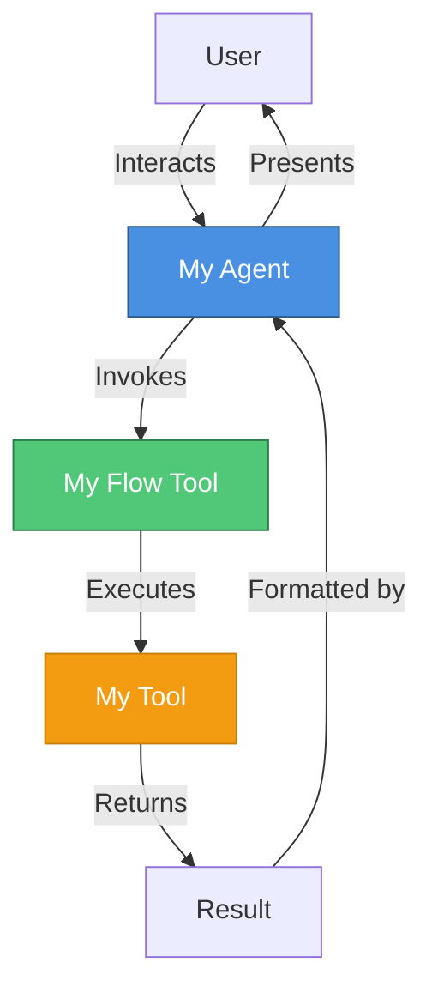
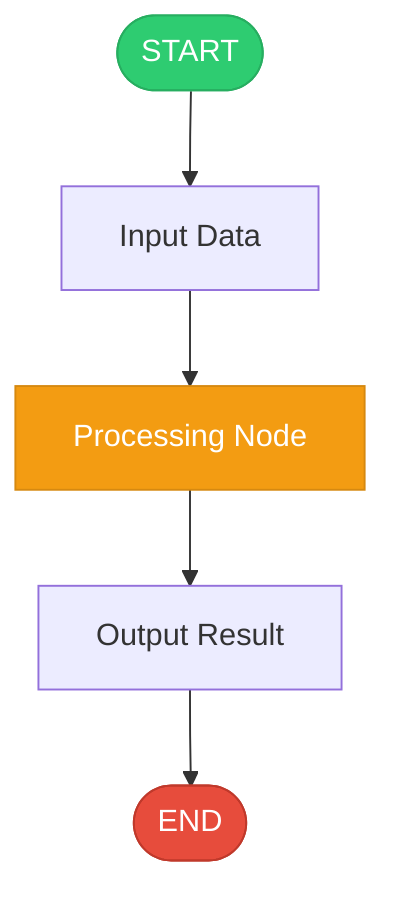
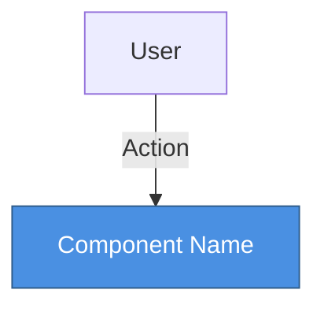
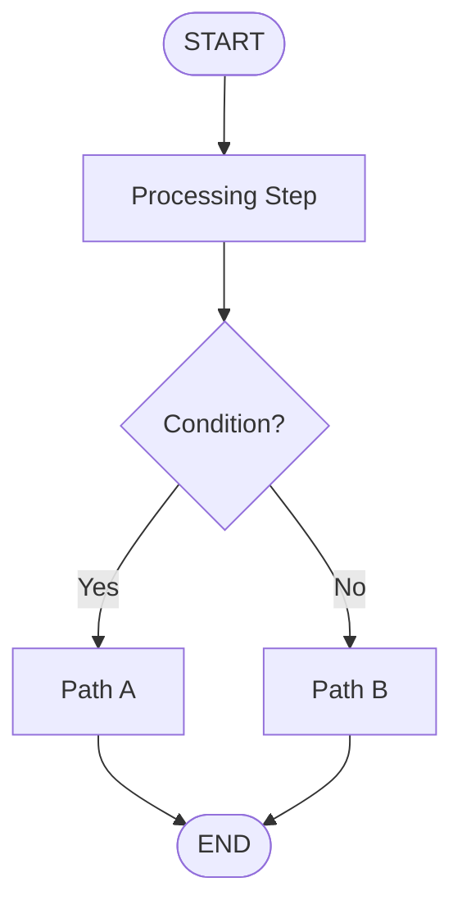

# watsonx Orchestrate (wxO) Solution Generator

## Table of Contents
1. [Overview](#overview)
2. [Navigating the ADK](#navigating-the-adk)
3. [Core Concepts](#core-concepts)
4. [Example Categories](#example-categories)
5. [Standard Project Structure](#standard-project-structure)
6. [Implementation Patterns](#implementation-patterns)
7. [Quick Start Guide](#quick-start-guide)

---

## Overview

This guide helps you **generate watsonx Orchestrate native solutions** from Standard Operating Procedures (SOPs) or simple prompts. It uses the **IBM watsonx Orchestrate Agent Development Kit (ADK)** as the foundation for implementing agents, flows, tools, and knowledge bases.

### Purpose

Generate complete watsonx Orchestrate implementations from:
- **SOPs**: Standard Operating Procedures (recommended - use `sop-builder` skill to generate SOPs from BPMN diagrams, n8n JSON, Langflow JSON, or other workflow models first)
- **Simple Prompts**: Direct descriptions of business requirements or workflows

### Workflow

1. **Start with Business Requirements**:
   - If you have BPMN diagrams, n8n JSON, Langflow JSON, or other workflow models → Use `sop-builder` skill to generate an SOP first
   - If you have a simple business requirement → Provide it directly as a prompt

2. **Generate wxO Solution**: This skill (`wxo-builder`) transforms the SOP or prompt into a complete watsonx Orchestrate implementation with:
   - Agent configurations (YAML)
   - Python tools and flows
   - Knowledge base integrations
   - Import scripts and documentation

**ADK Repository**: https://github.com/IBM/ibm-watsonx-orchestrate-adk

The ADK provides:
- **Python SDK** for programmatic agent development
- **CLI tool** (`orchestrate` command) for managing agents, tools, and environments
- **Developer Edition** - a local, self-contained instance of watsonx Orchestrate
- **Production Integration** - ability to deploy to production watsonx Orchestrate instances

---

## Navigating the ADK

### GitHub Repository

All examples and source code are available in the official GitHub repository:

**Repository**: [https://github.com/IBM/watsonx-orchestrate-adk](https://github.com/IBM/watsonx-orchestrate-adk)

### Key Directories in Repository

```
watsonx-orchestrate-adk/
├── examples/                         # Example implementations (START HERE)
│   ├── agent_builder/                # Agent examples
│   ├── flow_builder/                 # Flow examples
│   ├── channel-integrations/         # Channel integration examples
│   └── plugins/                      # Plugin examples
├── src/ibm_watsonx_orchestrate/     # SDK source (for reference)
│   ├── agent_builder/                # Agent creation APIs
│   ├── flow_builder/                 # Flow/workflow APIs
│   └── cli/                          # CLI commands
└── packages/                         # Additional packages
```

### How to Use This Guide

1. **Browse GitHub Examples** - Visit the [examples directory](https://github.com/IBM/watsonx-orchestrate-adk/tree/main/examples) to find examples similar to your use case
2. **Study Standard Structure** - Understand the consistent project layout
3. **Follow Implementation Patterns** - Use proven patterns for common scenarios
4. **Use Quick Start Guide** - Create new projects based on examples

---

## Core Concepts

### 1. **Agents**
AI assistants that can use tools and interact with users. Defined using YAML configuration:

```yaml
spec_version: v1
kind: native
name: my_agent
description: Agent description
instructions: Detailed instructions for the agent
llm: groq/openai/gpt-oss-120b
style: default
tools:
  - tool_name_1
  - tool_name_2
```

### 2. **Tools**
Functions that agents can invoke. Three main types:

- **Python Tools**: Python functions decorated with `@tool`
- **Flow Tools**: Workflows built with the flow builder
- **OpenAPI Tools**: REST APIs defined by OpenAPI specs

### 3. **Flows**
Workflows that orchestrate multiple steps, tools, and logic:

```python
from ibm_watsonx_orchestrate.flow_builder.flows import Flow, flow, START, END

@flow(
    name="my_flow",
    display_name="My Flow",
    description="Flow description",
    input_schema=MyInputSchema
)
def build_my_flow(aflow: Flow) -> Flow:
    # Define flow nodes and sequence
    node1 = aflow.tool(my_tool_function)
    node2 = aflow.prompt(
        name="process_data",
        system_prompt=["Process the data"],
        user_prompt=["Process this: {input}"],
        llm="meta-llama/llama-3-3-70b-instruct",
        input_schema=MyInputSchema,
        output_schema=MyOutputSchema
    )
    
    aflow.sequence(START, node1, node2, END)
    return aflow
```

**CRITICAL - Flow Function Signature:**
- Flow functions MUST follow this exact signature: `def build_<flow_name>(aflow: Flow) -> Flow:`
- The parameter MUST be named `aflow` with type `Flow`
- The function MUST return `Flow`
- The function name MUST start with `build_`
- Do NOT invent alternative signatures or parameter names

### 4. **Connections**
Authenticated connections to external services (ServiceNow, Salesforce, etc.)

### 5. **Knowledge Bases**
Document repositories that agents can search through for information

---

## LLM Usage Guidelines

### When to Use Built-in Prompt Nodes vs. Agents

**For Direct LLM Generation Tasks:**
When your specification calls for using an LLM directly to generate content, analyze text, or perform transformations, **use the built-in Prompt node in Flow** rather than creating custom tools or external LLM calls.

**Default LLM Model**: `groq/openai/gpt-oss-120b`

**Example - Using Prompt Node in Flow:**
```python
from ibm_watsonx_orchestrate.flow_builder.flows import Flow, flow, START, END

@flow(
    name="content_generator",
    display_name="Content Generator",
    description="Generate content using LLM"
)
def build_content_generator(aflow: Flow) -> Flow:
    # Use built-in Prompt node for LLM generation
    generate_node = aflow.prompt(
        name="generate_content",
        system_prompt=["You are a helpful content generator."],
        user_prompt=["Generate content based on: {input}"],
        llm="groq/openai/gpt-oss-120b",  # Default LLM model
        input_schema=InputSchema,
        output_schema=OutputSchema
    )
    
    aflow.sequence(START, generate_node, END)
    return aflow
```

**For Knowledge-Based Tasks:**
When your specification requires accessing knowledge bases, retrieving information from documents, or performing RAG (Retrieval-Augmented Generation), **rely on the agent's built-in knowledge base capabilities** rather than implementing custom retrieval logic.

**Example - Agent with Knowledge Base:**
```yaml
spec_version: v1
kind: native
name: knowledge_assistant
description: Assistant with access to knowledge base
instructions: |
  You are a helpful assistant with access to a knowledge base.
  Use the knowledge base to answer questions accurately.
llm: groq/openai/gpt-oss-120b
knowledge_bases:
  - my_knowledge_base
tools:
  - my_flow_tool
```

**Key Principles:**
1. **LLM Generation** → Use `aflow.prompt()` node in flows with `groq/openai/gpt-oss-120b`
2. **Knowledge Retrieval** → Use agent's `knowledge_bases` configuration
3. **Custom Logic** → Use Python tools only for business logic, API calls, or data transformations
4. **Don't Reinvent** → Leverage built-in capabilities instead of custom implementations

---
## Knowledge Base Providers

watsonx Orchestrate supports multiple knowledge base providers for RAG (Retrieval Augmented Generation) implementations. Choose the appropriate provider based on your existing infrastructure or requirements.

### Supported Knowledge Base Providers

#### 1. Built-in Milvus (Managed)
**Use When**: You don't have an existing vector database and want a fully managed solution.

**Configuration**:
```yaml
spec_version: v1
kind: knowledge_base
name: my_knowledge_base
description: Knowledge base with uploaded documents
documents:
  - path: document1.pdf
  - path: document2.pdf
vector_index:
  embeddings_model_name: ibm/slate-125m-english-rtrvr-v2
```

**Features**:
- Automatic document ingestion and indexing
- No external infrastructure required
- Supports PDF, DOCX, PPTX, XLSX, CSV, HTML, TXT
- Built-in embedding generation

**Authentication**: None required (managed service)

---

#### 2. AstraDB (DataStax)
**Use When**: You have an existing AstraDB instance or need Cassandra-based vector storage.

**Configuration**:
```yaml
spec_version: v1
kind: knowledge_base
name: my_astradb_kb
description: Knowledge base connected to AstraDB
app_id: my_astradb_connection
prioritize_built_in_index: false
conversational_search_tool:
  index_config:
    - astradb:
        api_endpoint: 'https://xxx-us-east-2.apps.astra.datastax.com'
        data_type: collection          # or 'table'
        collection: my_collection
        embedding_model_id: nvidia/nv-embedqa-e5-v5
        embedding_mode: server         # or 'client'
        port: '443'
        search_mode: vector            # 'vector', 'lexical', or 'hybrid'
        limit: 5
        field_mapping:
          title: title_field
          body: content_field
          url: url_field
```

**Features**:
- Server-side or client-side embeddings
- Multiple search modes (vector, lexical, hybrid)
- Collection or table-based storage
- Scalable cloud-native solution

**Authentication**: API Key (Application Token)
```bash
orchestrate connections configure -a my_astradb_connection --kind api_key
orchestrate connections set-credentials -a my_astradb_connection --api-key <TOKEN>
```

---

#### 3. Milvus (External)
**Use When**: You have an existing Milvus instance or need self-hosted vector storage.

**Configuration**:
```yaml
spec_version: v1
kind: knowledge_base
name: my_milvus_kb
description: Knowledge base connected to external Milvus
app_id: my_milvus_connection
prioritize_built_in_index: false
conversational_search_tool:
  index_config:
    - milvus:
        endpoint: 'https://my-milvus-instance.com'
        collection_name: my_collection
        embedding_provider: nvidia
        embedding_model: nvidia/nv-embedqa-e5-v5
        embedding_dimension: 1024
        field_mapping:
          title: title
          body: content
          url: source_url
```

**Features**:
- Self-hosted or cloud-hosted options
- High-performance vector search
- Flexible schema design
- Open-source foundation

**Authentication**: Basic Auth
```bash
orchestrate connections configure -a my_milvus_connection --kind basic
orchestrate connections set-credentials -a my_milvus_connection -u <USERNAME> -p <PASSWORD>
```

---

#### 4. Elasticsearch
**Use When**: You have an existing Elasticsearch cluster or need full-text + vector search.

**Configuration**:
```yaml
spec_version: v1
kind: knowledge_base
name: my_elasticsearch_kb
description: Knowledge base connected to Elasticsearch
app_id: my_elasticsearch_connection
prioritize_built_in_index: false
conversational_search_tool:
  index_config:
    - elasticsearch:
        endpoint: 'https://my-elasticsearch-cluster.com'
        index_name: my_index
        embedding_field: vector_embedding
        field_mapping:
          title: title
          body: content
          url: url
```

**Features**:
- Combined full-text and vector search
- Mature ecosystem and tooling
- Advanced query capabilities
- Hybrid search support

**Authentication**: API Key or Basic Auth
```bash
# API Key
orchestrate connections configure -a my_elasticsearch_connection --kind api_key
orchestrate connections set-credentials -a my_elasticsearch_connection --api-key <KEY>

# Basic Auth
orchestrate connections configure -a my_elasticsearch_connection --kind basic
orchestrate connections set-credentials -a my_elasticsearch_connection -u <USER> -p <PASS>
```

---

### When to Use Custom Python Tools Instead

If your vector database or search system is **NOT** one of the supported providers above, create a **custom Python tool** instead of using a knowledge base.

#### Unsupported Systems Requiring Custom Tools:
- Pinecone
- Weaviate
- Qdrant
- Chroma
- Custom REST APIs
- Legacy search systems
- Proprietary databases

#### Custom Tool Pattern for RAG:

```python
from ibm_watsonx_orchestrate.agent_builder.tools import tool
from pydantic import BaseModel, Field
from typing import List, Dict, Any
import requests

class SearchQuery(BaseModel):
    """Input for searching the knowledge base."""
    query: str = Field(..., description="The search query")
    top_k: int = Field(default=5, description="Number of results to return")

class SearchResult(BaseModel):
    """Search result from the knowledge base."""
    results: List[Dict[str, Any]] = Field(..., description="List of search results")

@tool(
    name="search_custom_vector_db",
    description="Search a custom vector database for relevant information"
)
def search_custom_vector_db(query: SearchQuery) -> SearchResult:
    """
    Search a custom vector database and return relevant results.
    
    Args:
        query: SearchQuery containing the search query and parameters

    Returns:
        SearchResult containing the list of relevant documents
    """
    # Example: Call your custom vector database API
    response = requests.post(
        "https://my-custom-db.com/search",
        json={
            "query": query.query,
            "limit": query.top_k
        },
        headers={"Authorization": f"Bearer {get_api_key()}"}
    )
    
    results = response.json()
    
    # Format results for the agent
    formatted_results = []
    for result in results.get("matches", []):
        formatted_results.append({
            "title": result.get("metadata", {}).get("title", ""),
            "content": result.get("text", ""),
            "score": result.get("score", 0.0),
            "source": result.get("metadata", {}).get("source", "")
        })
    
    return SearchResult(results=formatted_results)
```

**Agent Configuration with Custom Tool**:
```yaml
spec_version: v1
kind: native
name: my_agent_with_custom_search
description: Agent using custom search tool
instructions: |
  You are a helpful assistant. When users ask questions, use the 
  search_custom_vector_db tool to find relevant information, then 
  provide a clear answer with citations.
llm: groq/openai/gpt-oss-120b
style: react
tools:
  - search_custom_vector_db
```

---

### Provider Selection Decision Tree

```
Do you have an existing vector database?
├─ No → Use Built-in Milvus (managed)
└─ Yes → What type?
    ├─ AstraDB → Use AstraDB provider
    ├─ Milvus → Use Milvus provider
    ├─ Elasticsearch → Use Elasticsearch provider
    └─ Other (Pinecone, Weaviate, etc.) → Create Custom Python Tool
```

---

### Authentication Support Matrix

| Provider | Basic Auth | API Key | Bearer Token | OAuth |
|----------|-----------|---------|--------------|-------|
| Built-in Milvus | N/A | N/A | N/A | N/A |
| AstraDB | ❌ | ✅ | ❌ | ❌ |
| Milvus (External) | ✅ | ❌ | ❌ | ❌ |
| Elasticsearch | ✅ | ✅ | ❌ | ❌ |
| Custom Tool | Depends on implementation | | | |

---

### Best Practices

1. **Use Built-in Providers When Possible**: They offer better integration and automatic RAG orchestration
2. **Field Mapping**: Always configure field_mapping to match your data schema
3. **Embedding Models**: Choose embedding models compatible with your provider
4. **Connection Management**: Use connections for secure credential storage
5. **Testing**: Test knowledge base connectivity before deploying agents
6. **Custom Tools**: Only create custom tools when no built-in provider exists

---


## Example Categories

### 1. **Agent Builder Examples**

Browse: [examples/agent_builder/](https://github.com/IBM/watsonx-orchestrate-adk/tree/main/examples/agent_builder)

#### Customer Care
- **Location**: [customer_care/](https://github.com/IBM/watsonx-orchestrate-adk/tree/main/examples/agent_builder/customer_care)
- **Purpose**: Healthcare customer service agent
- **Features**: ServiceNow integration, benefits queries, doctor search
- **Key Components**:
  - Agent YAML configuration
  - Python tools for API integration
  - Connection setup for ServiceNow

#### Voice-Enabled Agents
- [voice_enabled_deepgram/](https://github.com/IBM/watsonx-orchestrate-adk/tree/main/examples/agent_builder/voice_enabled_deepgram) - Deepgram voice integration
- [voice_enabled_elevenlabs/](https://github.com/IBM/watsonx-orchestrate-adk/tree/main/examples/agent_builder/voice_enabled_elevenlabs) - ElevenLabs voice integration
- [voice_enabled_watson/](https://github.com/IBM/watsonx-orchestrate-adk/tree/main/examples/agent_builder/voice_enabled_watson) - Watson voice integration

### 2. **Flow Builder Examples**

Browse: [examples/flow_builder/](https://github.com/IBM/watsonx-orchestrate-adk/tree/main/examples/flow_builder)

#### Simple Flows

**[hello_message_flow/](https://github.com/IBM/watsonx-orchestrate-adk/tree/main/examples/flow_builder/hello_message_flow)**
- **Purpose**: Basic flow demonstrating message generation
- **Pattern**: Simple tool invocation
- **Use Case**: Learning flow basics

**[get_pet_facts/](https://github.com/IBM/watsonx-orchestrate-adk/tree/main/examples/flow_builder/get_pet_facts)**
- **Purpose**: Fetch and display pet facts
- **Pattern**: External API integration
- **Use Case**: Simple data retrieval

#### Document Processing Flows

**[document_processing/](https://github.com/IBM/watsonx-orchestrate-adk/tree/main/examples/flow_builder/document_processing)**
- **Purpose**: Extract structured data from documents
- **Pattern**: Watson Document Understanding integration
- **Key Features**:
  - KVP (Key-Value Pair) schema definition
  - Document processing node (`docproc`)
  - Support for PDFs and images

**[document_classifier/](https://github.com/IBM/watsonx-orchestrate-adk/tree/main/examples/flow_builder/document_classifier)**
- **Purpose**: Classify documents by type
- **Pattern**: Document analysis and categorization

**[document_extractor/](https://github.com/IBM/watsonx-orchestrate-adk/tree/main/examples/flow_builder/document_extractor)**
- **Purpose**: General document data extraction
- **Pattern**: Flexible extraction framework


#### Workflow Patterns

**[user_activity/](https://github.com/IBM/watsonx-orchestrate-adk/tree/main/examples/flow_builder/user_activity)**
- **Purpose**: Interactive user input collection
- **Pattern**: User activity nodes
- **Use Case**: Gathering structured user input

**[foreach_email/](https://github.com/IBM/watsonx-orchestrate-adk/tree/main/examples/flow_builder/foreach_email)**
- **Purpose**: Process multiple emails
- **Pattern**: Loop/iteration over collections
- **Use Case**: Batch processing

**[get_tuition_reimbursed/](https://github.com/IBM/watsonx-orchestrate-adk/tree/main/examples/flow_builder/get_tuition_reimbursed)**
- **Purpose**: Tuition reimbursement workflow
- **Pattern**: Multi-step approval process
- **Use Case**: Business process automation

#### Conditional Logic

**[get_pet_facts_if_else/](https://github.com/IBM/watsonx-orchestrate-adk/tree/main/examples/flow_builder/get_pet_facts_if_else)**
- **Purpose**: Conditional flow execution
- **Pattern**: If-else branching
- **Use Case**: Decision-based workflows

#### Advanced Patterns

**[collaborator_agents/](https://github.com/IBM/watsonx-orchestrate-adk/tree/main/examples/flow_builder/collaborator_agents)**
- **Purpose**: Multiple agents working together
- **Pattern**: Agent collaboration
- **Use Case**: Complex multi-agent scenarios

**[triage_workflow_agent_swarm/](https://github.com/IBM/watsonx-orchestrate-adk/tree/main/examples/flow_builder/triage_workflow_agent_swarm)**
- **Purpose**: Agent swarm for task distribution
- **Pattern**: Dynamic agent selection
- **Use Case**: Intelligent task routing

**[agent_scheduler/](https://github.com/IBM/watsonx-orchestrate-adk/tree/main/examples/flow_builder/agent_scheduler)**
- **Purpose**: Scheduled agent execution
- **Pattern**: Time-based triggers
- **Use Case**: Automated periodic tasks

---

## Standard Project Structure

Every example follows a consistent structure:

```
example_name/
├── __init__.py                    # Python package initialization
├── README.md                      # Documentation and usage instructions
├── main_flow.py                   # Programmatic testing script to test Flow.  Not needed if no flow is created.
├── import-all.sh                  # Import script for CLI
├── .env (optional)                # Environment variables
├── tools/                         # Tool implementations
│   ├── __init__.py
│   ├── tool_name.py              # Python tool definitions
│   └── flow_name.py              # Flow definitions
├── agents/                        # Agent configurations
│   └── agent_name.yaml           # Agent YAML files
└── generated/                     # Generated artifacts
    └── flow_spec.json            # Compiled flow specifications
```

### Key Files Explained

#### 1. **tools/[tool_name].py**
Python tools decorated with `@tool`:

```python
from ibm_watsonx_orchestrate.agent_builder.tools import tool, ToolPermission

@tool(permission=ToolPermission.READ_ONLY)
def my_tool(param: str) -> dict:
    """Tool description"""
    # Implementation
    return {"result": "value"}
```

#### 2. **tools/[flow_name].py**
Flow definitions using `@flow` decorator:

```python
from ibm_watsonx_orchestrate.flow_builder.flows import Flow, flow, START, END

@flow(
    name="my_flow",
    display_name="My Flow",
    description="Flow description",
    input_schema=InputSchema
)
def build_my_flow(aflow: Flow) -> Flow:
    # Build flow
    return aflow
```

**IMPORTANT - Flow Function Signature:**
- ALWAYS use: `def build_<flow_name>(aflow: Flow) -> Flow:`
- Parameter MUST be `aflow: Flow`
- Return type MUST be `Flow`
- Function name MUST start with `build_`
## CRITICAL CONSTRAINTS - MUST FOLLOW

### ⚠️ Decorator Requirements

**ALL functions MUST use decorators:**

```python
# Tools - ALWAYS @tool
from ibm_watsonx_orchestrate.agent_builder.tools import tool, ToolPermission

@tool(permission=ToolPermission.READ_ONLY)  # or READ_WRITE
def my_tool(param: str) -> dict:
    """Tool description"""
    return {"result": "value"}

# Flows - ALWAYS @flow with signature: def build_<name>(aflow: Flow) -> Flow
from ibm_watsonx_orchestrate.flow_builder.flows import Flow, flow, START, END

@flow(name="my_flow", display_name="My Flow", input_schema=Schema)
def build_my_flow(aflow: Flow) -> Flow:
    node = aflow.tool(my_tool)
    aflow.edge(START, node)
    aflow.edge(node, END)
    return aflow
```

**Rules:**
- ❌ NEVER regular functions without decorators
- ✅ Flow signature: `def build_<name>(aflow: Flow) -> Flow:`
- ✅ One flow per file: `tools/[flow_name]_flow.py`
- ✅ Tools can be grouped: `tools/[category]_tools.py`
- ✅ Credentials as regular parameters (no ExpectCredentials)

**Validation Checklist:**
- [ ] All functions have `@tool` or `@flow`
- [ ] Flows: `def build_<name>(aflow: Flow) -> Flow:`
- [ ] One flow per file
- [ ] Proper ToolPermission values


#### 3. **agents/[agent_name].yaml**
Agent configuration:

**CRITICAL - Required Agent YAML Fields:**
All agent YAML files MUST include these required fields:

```yaml
spec_version: v1                              # REQUIRED - Always use v1
kind: native                                  # REQUIRED - Use 'native' for standard agents
name: agent_name                              # REQUIRED - Unique agent identifier
description: Agent description                # REQUIRED - Clear description of agent purpose
instructions: Detailed instructions           # REQUIRED - Instructions for the LLM
llm: groq/openai/gpt-oss-120b  # REQUIRED - LLM model to use
style: default                                # REQUIRED - Agent style (default, react, etc.)
collaborators: []                             # OPTIONAL - List of collaborator agents
tools:                                        # REQUIRED - List of tools/flows
  - tool_or_flow_name
```

**DO NOT:**
- ❌ Omit `spec_version: v1` (will cause import errors)
- ❌ Omit `kind: native`
- ❌ Omit required fields like `llm`, `style`, or `tools`

#### 4. **main_flow.py**
Programmatic testing:

```python
import asyncio
from pathlib import Path
from examples.example_name.tools.flow_name import build_flow

async def main():
    flow_def = await build_flow().compile_deploy()
    generated_folder = f"{Path(__file__).resolve().parent}/generated"
    flow_def.dump_spec(f"{generated_folder}/flow.json")
    await flow_def.invoke({"input": "value"}, debug=True)

if __name__ == "__main__":
    asyncio.run(main())
```

#### 5. **import-all.sh**
CLI import script:

**CRITICAL - Import CLI Syntax:**
You MUST use the `orchestrate` CLI commands to import flows and agents. Do NOT use Python scripts or custom import methods.

```bash
#!/usr/bin/env bash

# orchestrate env activate local # only used if user asked to activate local env
SCRIPT_DIR=$( cd -- "$( dirname -- "${BASH_SOURCE[0]}" )" &> /dev/null && pwd )

# Import Python tools
for tool in tool1.py tool2.py; do
  orchestrate tools import -k python -f ${SCRIPT_DIR}/tools/${tool}
done

# Import Flow tools
for flow in flow1.py; do
  orchestrate tools import -k flow -f ${SCRIPT_DIR}/tools/${flow}
done

# Import agents
for agent in agent1.yaml; do
  orchestrate agents import -f ${SCRIPT_DIR}/agents/${agent}
done
```

**IMPORTANT - CLI Command Reference:**
- **Import Python Tools**: `orchestrate tools import -k python -f <path_to_tool.py>`
- **Import Flow Tools**: `orchestrate tools import -k flow -f <path_to_flow.py>`
- **Import Agents**: `orchestrate agents import -f <path_to_agent.yaml>`

**DO NOT:**
- ❌ Use custom Python import scripts (e.g., `python3 main_flow.py`)
- ❌ Use API client methods directly in import scripts
- ❌ Invent alternative import methods

**ALWAYS:**
- ✅ Use the `orchestrate` CLI commands shown above
- ✅ Use the `-k` flag to specify tool kind (python or flow)
- ✅ Use the `-f` flag to specify the file path
- ✅ Use `${SCRIPT_DIR}` for relative paths in the script

---

## Implementation Patterns

### Pattern 1: Simple Tool Flow

**Use Case**: Basic data retrieval or processing

**Structure**:
```
example/
├── tools/
│   ├── my_tool.py          # Python tool
│   └── my_flow.py          # Flow that uses the tool
├── agents/
│   └── my_agent.yaml       # Agent configuration
└── main.py                 # Testing script
```

**Example**: `get_pet_facts/`

### Pattern 2: Document Processing Flow

**Use Case**: Extract structured data from documents

**Structure**:
```
example/
├── tools/
│   ├── get_kvp_schemas.py  # Define extraction schema
│   └── processing_flow.py  # Document processing flow
├── agents/
│   └── doc_agent.yaml      # Agent configuration
└── main.py                 # Testing script
```

**Key Components**:
1. **KVP Schema Tool**: Defines what fields to extract
2. **Document Processing Node**: Uses Watson Document Understanding
3. **Flow**: Orchestrates schema retrieval and document processing

**IMPORTANT - Document Upload Handling**:
When a flow expects a document as input (e.g., `DocProcInput`), the agent should invoke the flow tool directly without asking the user to upload the document first. The flow itself will handle the document upload prompt.

- ✅ **Correct Agent Instructions**:
  ```yaml
  instructions: |
    When the user wants to process a document, immediately invoke the
    document_processing_flow tool. The flow will prompt the user to
    upload the document.
  ```

- ❌ **Incorrect Agent Instructions**:
  ```yaml
  instructions: |
    Ask the user to upload a document first, then pass it to the
    document_processing_flow tool.
    # This will NOT work - the agent cannot pass uploaded documents to flows
  ```

**Why**: Agents cannot directly pass user-uploaded documents to flow tools. The flow's document input nodes (like `docproc`) handle the upload interaction directly with the user. The agent should simply invoke the flow tool and let the flow manage the document upload process.

**Example**: `extract_airline_invoice/`, `document_processing/`, `expense_report_agent/`, `invoice_agent_6/`

### Pattern 3: User Activity Flow

**Use Case**: Interactive multi-step workflows

**Structure**:
```
example/
├── tools/
│   └── activity_flow.py    # Flow with user activity nodes
├── agents/
│   └── activity_agent.yaml # Agent configuration
└── main.py                 # Testing script
```

**Key Features**:
- User activity nodes for input collection
- Form handling
- Multi-turn conversations

**Example**: `user_activity/`, `book_a_flight/`

### Pattern 4: Multi-Agent Collaboration

**Use Case**: Complex tasks requiring multiple specialized agents

**Structure**:
```
example/
├── tools/
│   ├── agent1_tools.py     # Tools for agent 1
│   ├── agent2_tools.py     # Tools for agent 2
│   └── orchestration_flow.py # Coordination flow
├── agents/
│   ├── agent1.yaml         # Specialized agent 1
│   ├── agent2.yaml         # Specialized agent 2
│   └── coordinator.yaml    # Coordinator agent
└── main.py                 # Testing script
```

**Example**: `collaborator_agents/`, `triage_workflow_agent_swarm/`

---

## Quick Start Guide

### Creating a New Example

#### Step 1: Create Directory Structure

> **Note**: You can reference existing examples from the [GitHub repository](https://github.com/IBM/watsonx-orchestrate-adk/tree/main/examples) for structure and patterns.

```bash
mkdir -p my_example/{tools,agents,generated}
touch my_example/{__init__.py,main_flow.py,README.md,import-all.sh}
touch my_example/tools/__init__.py
```

#### Step 2: Create Python Tool (if needed)
```python
# tools/my_tool.py
from ibm_watsonx_orchestrate.agent_builder.tools import tool, ToolPermission

@tool(permission=ToolPermission.READ_ONLY)
def my_tool(input_param: str) -> dict:
    """Tool description"""
    return {"result": f"Processed: {input_param}"}
```

#### Step 3: Create Flow
```python
# tools/my_flow.py
from pydantic import BaseModel
from ibm_watsonx_orchestrate.flow_builder.flows import Flow, flow, START, END
from .my_tool import my_tool

class MyFlowInput(BaseModel):
    input_param: str

@flow(
    name="my_flow",
    display_name="My Flow",
    description="Flow description",
    input_schema=MyFlowInput
)
def build_my_flow(aflow: Flow) -> Flow:
    """
    CRITICAL: Flow function signature MUST be:
    def build_<flow_name>(aflow: Flow) -> Flow:
    """
    tool_node = aflow.tool(my_tool)
    aflow.sequence(START, tool_node, END)
    return aflow
```

#### Step 4: Create Agent Configuration
```yaml
# agents/my_agent.yaml
spec_version: v1
kind: native
name: my_agent
description: My agent description
instructions: Invoke my_flow tool and output the result
llm: groq/openai/gpt-oss-120b
style: default
tools:
  - my_flow
```

#### Step 5: Create Main Script (only needed if there are flows in the projects)

> **Tip**: See [flow examples](https://github.com/IBM/watsonx-orchestrate-adk/tree/main/examples/flow_builder) for complete working implementations.

```python
# main_flow.py
import asyncio
from pathlib import Path
from my_example.tools.my_flow import build_my_flow

async def main():
    flow_def = await build_my_flow().compile_deploy()
    generated_folder = f"{Path(__file__).resolve().parent}/generated"
    flow_def.dump_spec(f"{generated_folder}/my_flow.json")
    await flow_def.invoke({"input_param": "test"}, debug=True)

if __name__ == "__main__":
    asyncio.run(main())
```

#### Step 6: Create Import Script

**CRITICAL**: Always use the `orchestrate` CLI commands to import flows and agents.

```bash
# import-all.sh
#!/usr/bin/env bash

# orchestrate env activate local
SCRIPT_DIR=$( cd -- "$( dirname -- "${BASH_SOURCE[0]}" )" &> /dev/null && pwd )

# Import Python tools (if any)
for tool in my_tool.py; do
  orchestrate tools import -k python -f ${SCRIPT_DIR}/tools/${tool}
done

# Import Flow tools - MUST use: orchestrate tools import -k flow
for flow in my_flow.py; do
  orchestrate tools import -k flow -f ${SCRIPT_DIR}/tools/${flow}
done

# Import agents - MUST use: orchestrate agents import
for agent in my_agent.yaml; do
  orchestrate agents import -f ${SCRIPT_DIR}/agents/${agent}
done
```

**Required CLI Commands:**
- Python tools: `orchestrate tools import -k python -f <file>`
- Flow tools: `orchestrate tools import -k flow -f <file>`
- Agents: `orchestrate agents import -f <file>`

#### Step 7: Make Import Script Executable
```bash
chmod +x my_example/import-all.sh
```

#### Step 8: Create README with Diagrams

> **Examples**: Browse [GitHub examples](https://github.com/IBM/watsonx-orchestrate-adk/tree/main/examples) to see complete README files with diagrams.

```markdown
# My Example

## Overview
Brief description of what this example demonstrates.

## Architecture Diagram



## Workflow Diagram



## Usage

### Via Chat UI
1. Run `./import-all.sh`
2. Launch chat: `orchestrate chat start`
3. Select `my_agent`
4. Interact with the agent

### Programmatically
1. Set PYTHONPATH: `export PYTHONPATH=<ADK>/src:<ADK>`
2. Run: `python3 main.py`

## Features
- Feature 1
- Feature 2

## Output
Description of expected output
```

### Testing Your Example

#### Option 1: Via Chat UI
```bash
cd examples/category/my_example
./import-all.sh
orchestrate chat start
# Select your agent and interact
```

#### Option 2: Programmatically
```bash
export PYTHONPATH=/path/to/adk/src:/path/to/adk
cd examples/category/my_example
python3 main.py
```

---

## Best Practices

### 1. **Naming Conventions**
- Use snake_case for Python files and functions
- Use descriptive names that indicate purpose
- Agent names should match their YAML file names

### 2. **Documentation**
- Always include a README.md with:
  - Purpose and overview
  - **Architecture Diagram**: Mermaid diagram showing agent, flow, and tool relationships
  - **Workflow Diagram(s)**: One Mermaid diagram per agentic workflow showing the flow execution path
  - Usage instructions (both CLI and programmatic)
  - Expected inputs/outputs
  - Prerequisites or dependencies

#### Creating Effective Diagrams

**Architecture Diagram Guidelines:**
- Show the high-level system components (User → Agent → Flow → Tools/Services)
- Include external services or APIs being used
- Use consistent color coding (e.g., agents in blue, flows in green, tools in orange)
- Keep it simple and focused on the main interaction flow

**Workflow Diagram Guidelines:**
- Create one diagram per agentic workflow (flow tool)
- Show the complete flow from START to END
- Include all nodes: tool nodes, LLM nodes, decision points, user activity nodes
- Label branches clearly for conditional logic
- Use different colors for different node types
- Include key data transformations or processing steps

**Example Mermaid Syntax:**




### 4. **Error Handling**
- Include proper error handling in tools
- Provide meaningful error messages
- Use try-except blocks for external API calls

### 5. **Type Hints and Pydantic Models**
- Use Pydantic models for input/output schemas
- Include type hints in function signatures
- Document expected types in docstrings
- **IMPORTANT**: Always define Pydantic models explicitly as classes, never use dynamic type creation
  - ✅ **Correct**: Define models as proper classes
    ```python
    class MyOutputSchema(BaseModel):
        field_name: str = Field(description="Field description")
    ```
  - ❌ **Incorrect**: Do not use dynamic type creation
    ```python
    # This will cause Pydantic validation errors
    output_schema=type('MySchema', (BaseModel,), {
        'field_name': (str, Field(description="Field description"))
    })
    ```
  - All model fields must have proper type annotations
  - Dynamic type creation causes "non-annotated attribute" errors during model loading

### 6. **Python Docstring Format (CRITICAL)**

**MUST use Google-style docstrings** for all Python tools. The watsonx Orchestrate tool parser requires strict adherence to this format.

#### ✅ **Correct Format**

```python
@tool(permission=ToolPermission.READ_WRITE)
def my_tool(
    param1: str,
    param2: int,
    optional_param: Optional[str] = None
) -> MyOutputModel:
    """
    Brief description of what the tool does.
    
    Longer description providing more context about the tool's
    purpose and behavior (optional).
    
    Args:
        param1 (str): Description of param1
        param2 (int): Description of param2
        optional_param (Optional[str]): Description of optional parameter

    Returns:
        MyOutputModel: Description of what is returned
    """
    # Implementation
    pass
```

#### Key Rules

1. **NO blank line between Args and Returns sections** - Extra blank lines cause validation errors
2. **Always include type annotations in Args** - Format: `param_name (Type): Description`
3. **Returns section must include both type and description** - Format: `TypeName: Description`
4. **Type hints in function signature are REQUIRED** - All parameters and return type must have type hints
5. **Types must match** - Docstring types must match function signature type hints
6. **Use proper indentation** - Args/Returns sections have no indentation, descriptions use 4 spaces

#### Complete Working Example

```python
from pydantic import BaseModel, Field
from typing import Optional
from ibm_watsonx_orchestrate.agent_builder.tools import tool, ToolPermission


class RequestResult(BaseModel):
    """Result of request processing"""
    request_id: str
    status: str
    message: str


@tool(permission=ToolPermission.READ_WRITE)
def process_request(
    request_id: str,
    user_email: str,
    description: str,
    priority: Optional[str] = "normal"
) -> RequestResult:
    """
    Process a service request and create a ticket.
    
    This tool receives a service request from a user and creates
    an official ticket in the system for tracking.
    
    Args:
        request_id (str): Unique identifier for the request
        user_email (str): Email address of the requesting user
        description (str): Detailed description of the issue
        priority (Optional[str]): Priority level (default: normal)

    Returns:
        RequestResult: Processing result with status and message
    """
    return RequestResult(
        request_id=request_id,
        status="created",
        message=f"Request {request_id} created for {user_email}"
    )
```

### 7. **Credential Configuration**

#### Connection YAML Files
Connection YAML files define how tools authenticate to external services. They must follow this exact format:

**Required Fields for ALL Connections:**
```yaml
spec_version: v1              # REQUIRED: Must be 'v1'
kind: connection              # REQUIRED: Must be 'connection' (singular, not 'connections')
app_id: my_connection_name    # REQUIRED: Unique identifier for this connection
environments:                 # REQUIRED: At least 'draft' environment must be defined
  draft:                      # REQUIRED: Draft environment configuration
    security_scheme: <type>   # REQUIRED: One of the valid security schemes (see below)
    type: team                # REQUIRED: 'team' or 'member' (team = shared credentials)
    # Additional fields depend on security_scheme
```

**Valid Security Schemes:**
1. `api_key_auth` - For API key authentication
2. `bearer_token` - For bearer token authentication
3. `basic_auth` - For basic username/password authentication
4. `oauth2` - For OAuth2 flows (requires additional `auth_type` field)
5. `key_value_creds` - For key-value credential pairs

**API Key Authentication Example:**
```yaml
spec_version: v1
kind: connection
app_id: apify
environments:
  draft:
    security_scheme: api_key_auth
    type: team
    server_url: https://api.apify.com
```

**OAuth2 Authentication Example:**
```yaml
spec_version: v1
kind: connection
app_id: google_sheets
environments:
  draft:
    security_scheme: oauth2
    auth_type: oauth2_auth_code    # REQUIRED for OAuth2: Must be 'oauth2_auth_code'
    type: team
    server_url: https://sheets.googleapis.com
    auth_url: https://accounts.google.com/o/oauth2/v2/auth
    token_url: https://oauth2.googleapis.com/token
    scope:
      - https://www.googleapis.com/auth/spreadsheets.readonly
      - https://www.googleapis.com/auth/drive.readonly
```

**Common Mistakes in Connection YAMLs:**
- ❌ Using `kind: connections` (plural) - Must be `kind: connection` (singular)
- ❌ Using `kind:` inside environments - Must be `security_scheme:`
- ❌ Using `auth_type: authorization_code` for OAuth2 - Must be `auth_type: oauth2_auth_code`
- ❌ Missing `auth_type` field for OAuth2 connections
- ❌ Missing `spec_version` field

#### Python Tool Credential Declaration

**CRITICAL: Tools requiring credentials must NOT include credential parameters in their function signature.**

✅ **Correct Tool Signature** (credentials fetched at runtime):
```python
from ibm_watsonx_orchestrate.agent_builder.tools import tool, ToolPermission
from ibm_watsonx_orchestrate.agent_builder.connections import ConnectionType, ExpectedCredentials
from ibm_watsonx_orchestrate.run import connections

APIFY_APP_ID = 'apify'

@tool(
    permission=ToolPermission.READ_ONLY,
    expected_credentials=[
        ExpectedCredentials(app_id=APIFY_APP_ID, type=ConnectionType.API_KEY_AUTH)
    ]
)
def search_linkedin_person(
    first_name: str,
    last_name: str,
    company: str,
    max_results: int = 10
) -> List[Dict[str, Any]]:
    """
    Search Google for a person's LinkedIn profile using Apify.
    
    Args:
        first_name (str): Person's first name
        last_name (str): Person's last name
        company (str): Company name
        max_results (int): Maximum number of search results to return
    """
    # Fetch credentials at runtime from connection
    conn = connections.api_key_auth(APIFY_APP_ID)
    apify_api_key = conn.api_key
    
    # Use the API key in your requests
    headers = {"Authorization": f"Bearer {apify_api_key}"}
    # ... rest of implementation
```

❌ **Incorrect Tool Signature** (credential as parameter):
```python
# WRONG: Do not include credential parameters in function signature
@tool(
    permission=ToolPermission.READ_ONLY,
    expected_credentials=[
        ExpectedCredentials(app_id=APIFY_APP_ID, type=ConnectionType.API_KEY_AUTH)
    ]
)
def search_linkedin_person(
    first_name: str,
    last_name: str,
    company: str,
    apify_api_key: str,  # ❌ WRONG: Remove this parameter
    max_results: int = 10
) -> List[Dict[str, Any]]:
    # This will cause type hint parsing warnings
```

**Fetching Credentials at Runtime:**
```python
from ibm_watsonx_orchestrate.run import connections

# For API Key Auth
conn = connections.api_key_auth('my_app_id')
api_key = conn.api_key

# For OAuth2
conn = connections.oauth2_auth_code('my_app_id')
access_token = conn.access_token

# For Basic Auth
conn = connections.basic('my_app_id')
username = conn.username
password = conn.password

# For Bearer Token
conn = connections.bearer_token('my_app_id')
token = conn.token
```

**Common ConnectionType Values:**
- `ConnectionType.API_KEY_AUTH` - For API key authentication
- `ConnectionType.OAUTH2_AUTH_CODE` - For OAuth2 authorization code flow
- `ConnectionType.BASIC_AUTH` - For basic username/password authentication
- `ConnectionType.BEARER_TOKEN` - For bearer token authentication
- `ConnectionType.KEY_VALUE` - For key-value credential pairs

**Import Script Requirements:**
When importing tools with credentials, you must:
1. Import connections FIRST (before tools)
2. Use `--app-id` flag when importing tools

```bash
# Step 1: Import connections
orchestrate connections import -f connections/apify.yaml
orchestrate connections import -f connections/google_sheets.yaml

# Step 2: Import tools with --app-id flags
orchestrate tools import -k python -f tools/linkedin_tools.py --app-id apify
orchestrate tools import -k python -f tools/sheets_tools.py --app-id google_sheets

# Step 3: Configure credentials (done separately for security)
orchestrate connections configure apify draft
orchestrate connections configure google_sheets draft
```

**Key Points:**
- Connection YAMLs define the structure, NOT the actual credentials
- Actual credentials are set separately using `orchestrate connections configure`
- Tools fetch credentials at runtime using the `connections` module
- Never hardcode credentials in tool code or connection YAMLs
- The `app_id` in connection YAML must match the `app_id` in `ExpectedCredentials`

### 8. **Testing**
- Provide both CLI and programmatic testing methods
- Include example inputs in README
- Test with various input scenarios

### 9. **Modularity**
- Keep tools focused and single-purpose
- Separate concerns (tools, flows, agents)
- Reuse common utilities

---

## Common Patterns Reference

### Document Processing Pattern

#### Defining KVP Schemas with DocProcField

**IMPORTANT**: When creating KVP schemas for DocProcNode, you must use the `DocProcField` class to describe each field, not plain Python dictionaries. This ensures proper type validation and schema structure.

```python
from ibm_watsonx_orchestrate.flow_builder.types import (
    DocProcKVPSchema,
    DocProcField,
    DocProcOutputFormat,
)

# ✅ Correct - Using DocProcField class for field definitions
INVOICE_KVP_SCHEMA = DocProcKVPSchema(
    document_type="Invoice",
    document_description="A business invoice document with itemized line items",
    additional_prompt_instructions="Extract all values exactly as they appear in the document.",
    fields={
        "invoice_number": DocProcField(
            description="The unique identifier for the invoice",
            default="",
            example="INV-2024-001234",
        ),
        "invoice_date": DocProcField(
            description="The date the invoice was issued",
            default="",
            example="2024-01-15",
        ),
        "vendor_name": DocProcField(
            description="The name of the company or person issuing the invoice",
            default="",
            example="ABC Services Inc.",
        ),
        "total_amount": DocProcField(
            description="The final total amount due",
            default="",
            example="$6,464.25",
        ),
    }
)

# ❌ Incorrect - Using plain dictionaries (will cause errors)
WRONG_KVP_SCHEMA = {
    "document_type": "Invoice",
    "fields": {
        "invoice_number": {
            "description": "The unique identifier for the invoice",
            "example": "INV-2024-001234"
        }
    }
}
```

**Key Points:**
- Always import `DocProcKVPSchema` and `DocProcField` from `ibm_watsonx_orchestrate.flow_builder.types`
- Use `DocProcKVPSchema` to wrap the entire schema definition
- Use `DocProcField` for each field in the `fields` dictionary
- Each `DocProcField` should include:
  - `description`: Clear description of what the field contains
  - `default`: Default value (typically empty string for optional fields)
  - `example`: Example value to guide extraction

#### Complete Document Processing Flow Example

```python
from pydantic import BaseModel, Field
from ibm_watsonx_orchestrate.flow_builder.flows import Flow, flow, START, END
from ibm_watsonx_orchestrate.flow_builder.types import (
    DocProcInput,
    DocProcKVPSchema,
    DocProcField,
    DocProcOutputFormat,
)

# 1. Define KVP Schema using DocProcField
DOCUMENT_KVP_SCHEMA = DocProcKVPSchema(
    document_type="Invoice",
    document_description="Business invoice document",
    additional_prompt_instructions="Extract all values exactly as they appear.",
    fields={
        "field_name": DocProcField(
            description="Field description",
            default="",
            example="Example value",
        ),
    }
)

# 2. Create Document Processing Flow
@flow(name="doc_flow", input_schema=DocProcInput)
def build_doc_flow(aflow: Flow) -> Flow:
    """
    CRITICAL: Always use signature: def build_<flow_name>(aflow: Flow) -> Flow:
    """
    doc_node = aflow.docproc(
        name="extract_data",
        task="text_extraction",
        document_structure=True,
        enable_hw=True,
        output_format=DocProcOutputFormat.object,  # Returns JSON object instead of file reference
        kvp_schemas=[DOCUMENT_KVP_SCHEMA],  # Pass the schema directly
        kvp_force_schema_name="Invoice",
    )
    
    # Explicit input mapping
    doc_node.map_input(
        input_variable="document_ref",
        expression="flow.input.document_ref"
    )
    doc_node.map_input(
        input_variable="kvp_schemas",
        expression="flow.input.kvp_schemas"
    )
    
    aflow.sequence(START, doc_node, END)
    
    # IMPORTANT: KVPs have complex structure with key.semantic_label and value.raw_text
    # Recommended: Pass entire KVP array to a prompt node for formatting
    # See "CRITICAL: Document Processing KVP Structure" section below for details
    
    return aflow
```

**Alternative: Using Code Blocks or Python Tools for Complex Processing**

If you need custom Python logic that cannot be expressed in single-line expressions, you have two options:

1. **Code Block (Script Node)** - Faster, but with restrictions
   - Use `aflow.script()` to add a code block node
   - Executes Python code within the flow
   - **Restrictions**: Limited imports, no file I/O, restricted libraries
   - See: https://www.ibm.com/docs/en/watsonx/watson-orchestrate/base?topic=workflows-code-blocks

2. **Python Tool** - More flexible, but slower
   - Create a separate Python tool with `@tool` decorator
   - Can use any Python libraries and imports
   - Called as a tool node in the flow: `aflow.tool(my_tool_function)`
   - Better for complex logic, external API calls, or file operations

Example using code block for KVP processing:
```python
# Code block to extract specific KVP values
code_block = aflow.script(
    name="extract_kvp_values",
    code="""
# Extract values from KVP structure
vendor = next((kvp['value']['raw_text'] for kvp in kvps
               if kvp.get('key', {}).get('semantic_label') == 'vendor_name'), '')
total = next((kvp['value']['raw_text'] for kvp in kvps
              if kvp.get('key', {}).get('semantic_label') == 'total_amount'), '')
result = {'vendor': vendor, 'total': total}
""",
    input_schema=KVPInput,
    output_schema=ExtractedValues
)
```

**Recommendation**: For KVP processing, use a **prompt node** to format the data rather than code blocks or complex expressions. The LLM can intelligently parse the KVP structure and create user-friendly output.

**IMPORTANT: Prompt Node Requirements**
- The `system_prompt` parameter is **REQUIRED** for all prompt nodes
- It must be a string or list of strings defining the assistant's role
- Example: `system_prompt="You are a helpful assistant that formats data."`

**CRITICAL: Document Processing KVP Structure**

When using `output_format=DocProcOutputFormat.object` in docproc nodes, the `kvps` field is returned as a **list** of complex objects with the following structure:

```json
{
  "id": "KVP_000001",
  "type": "only_value",
  "key": {
    "id": "KEY_000001",
    "semantic_label": "vendor_name",
    "raw_text": null,
    "normalized_text": null,
    "confidence_score": null,
    "bbox": null
  },
  "value": {
    "id": "VALUE_000001",
    "raw_text": "ABC Store Inc.",
    "normalized_text": null,
    "confidence_score": 0.95,
    "bbox": {...}
  },
  "group_id": null,
  "table_id": null
}
```

**Key Points:**
- Each KVP has a `key` object with `semantic_label` (the field name from your schema)
- Each KVP has a `value` object with `raw_text` (the extracted value)
- To access a specific field, match the `semantic_label` and extract the `raw_text`

**Two Approaches to Handle KVPs:**

1. **Pass Entire KVP Array to Prompt Node** (Recommended)
   - Let an LLM format the complex KVP structure into user-friendly output
   - The prompt node receives the full KVP array and formats it

```python
# Create a prompt node to format KVPs
# IMPORTANT: system_prompt is REQUIRED for prompt nodes
summary_node = aflow.prompt(
    name="format_summary",
    system_prompt="You are a helpful assistant that formats data.",
    user_prompt=["Format this data: {kvps}"],
    output_schema=SummaryOutput
)

# Map the entire KVP array to the prompt
summary_node.map_input(
    input_variable="kvps",
    expression="flow['extract_data'].output.kvps"
)

# Output the formatted summary
aflow.map_output(
    output_variable="summary",
    expression="flow['format_summary'].output.summary"
)
```

2. **Extract Individual Fields Using List Comprehension**
   - Use single-line Python expressions in `map_output`
   - Match `semantic_label` and extract `raw_text`

```python
# ✅ Correct - Extract value by semantic_label using list comprehension
aflow.map_output(
    output_variable="vendor_name",
    expression="[kvp['value']['raw_text'] for kvp in flow['extract_data'].output.kvps if kvp.get('key', {}).get('semantic_label') == 'vendor_name'][0] if [kvp for kvp in flow['extract_data'].output.kvps if kvp.get('key', {}).get('semantic_label') == 'vendor_name'] else ''"
)

# ❌ Incorrect - Cannot use Python functions in expressions
def get_value(field):  # This won't work at runtime!
    return f"flow['node'].output.kvps[0].get('{field}')"

# ❌ Incorrect - Wrong structure (kvps is not a simple dictionary)
aflow.map_output(
    output_variable="vendor_name",
    expression="flow['extract_data'].output.kvps[0].get('vendor_name', '')"
)
```

**IMPORTANT: Expression Constraints**
- Output mapping expressions must be **single-line Python expressions**
- You **cannot define or call Python functions** in expressions
- Functions defined in your flow file are **not available at runtime**
- Use list comprehensions and inline logic only
- The flow engine evaluates expressions in its own runtime context

### User Activity Pattern
```python
@flow(name="user_flow", input_schema=InputSchema)
def build_user_flow(aflow: Flow) -> Flow:
    activity_node = aflow.user_activity(
        name="collect_input",
        display_name="Collect User Input",
        description="Gather information from user"
    )
    
    process_node = aflow.tool(process_data)
    
    aflow.sequence(START, activity_node, process_node, END)
    return aflow
```

### Conditional Flow Pattern
```python
@flow(name="conditional_flow", input_schema=InputSchema)
def build_conditional_flow(aflow: Flow) -> Flow:
    """
    CRITICAL: Always use signature: def build_<flow_name>(aflow: Flow) -> Flow:
    """
    check_node = aflow.tool(check_condition)
    
    true_branch = aflow.tool(handle_true)
    false_branch = aflow.tool(handle_false)
    
    aflow.sequence(START, check_node)
    aflow.if_else(
        condition="flow.check_node.output.is_valid",
        if_true=true_branch,
        if_false=false_branch
    )
    aflow.sequence(true_branch, END)
    aflow.sequence(false_branch, END)
    
    return aflow
```
---

## Additional Resources

- **Official Documentation**: https://developer.watson-orchestrate.ibm.com
- **ADK GitHub Repository**: https://github.com/IBM/watsonx-orchestrate-adk
- **Examples Directory**: [examples/](https://github.com/IBM/watsonx-orchestrate-adk/tree/main/examples) in the ADK repository
- **API Reference**: [src/ibm_watsonx_orchestrate/](https://github.com/IBM/watsonx-orchestrate-adk/tree/main/src/ibm_watsonx_orchestrate)
- **Support**: IBM watsonx Orchestrate support channels

